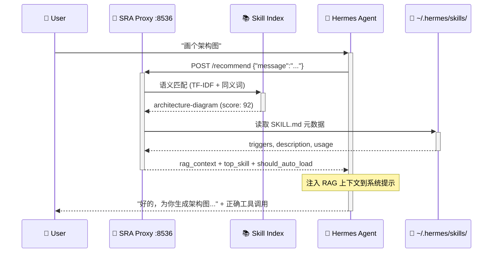

# SRA — Skill Runtime Advisor 🎯

[](https://www.python.org/)
[](./LICENSE)
[](https://github.com/JackSmith111977/Hermes-Skill-View)
[](https://pypi.org/project/sra-agent/)

> **为 Hermes Agent 解决技能发现痛点的运行时消息前置推理中间件。**  
> 每次用户消息到达 Agent 之前，先经过 SRA Proxy 语义分析，自动注入最匹配技能（SKILL.md）的 RAG 上下文——让 Agent 永远知道当前任务该用什么能力。

🌐 [English README](README_en.md) · 📖 [Runtime Design](./RUNTIME.md) · ⚡ [Quick Install](#安装) · 🩺 [Integration Guide](./docs/INTEGRATION.md)

---

## 📐 架构总览

### 消息流时序图



### 组件架构图

```mermaid
flowchart LR
    subgraph Input["📥 输入层"]
        U[User Message<br/>自然语言查询]
    end

    subgraph SRA["🎯 SRA 中间件层"]
        direction TB
        P[SRA Proxy :8536<br/>Unix Socket + HTTP]
        M[匹配引擎<br/>TF-IDF + 同义词 + 共现矩阵]
        I[(Skill Index Store<br/>275+ skills indexed)]
    end

    subgraph Agent["🤖 Agent 消费层"]
        direction TB
        H[Hermes Agent<br/>注入 rag_context]
        T[工具执行<br/>terminal / file / web]
    end

    subgraph Output["📤 输出层"]
        R[Agent Response<br/>正确的技能 + 工具调用]
    end

    U -->|POST /recommend| P
    P -->|lookup| M
    M -->|query| I
    I -->|scan| SK[~/.hermes/skills/<br/>SKILL.md files]
    P -->|rag_context + top_skill| H
    H -->|enhanced context| T
    T --> R

    classDef input fill:#e0f2fe,stroke:#0284c7,color:#0c4a6e
    classDef sra fill:#f0fdf4,stroke:#16a34a,color:#14532d
    classDef agent fill:#fefce8,stroke:#ca8a04,color:#713f12
    classDef output fill:#fce7f3,stroke:#db2777,color:#831843
    classDef storage fill:#f3e8ff,stroke:#9333ea,color:#581c87

    class U input
    class P,M,SRA sra
    class I,SK storage
    class H,T Agent agent
    class R output
```

**一句话解释**：用户说"画个架构图" → SRA 在 < 5ms 内找到 `architecture-diagram` 技能 → 把技能的触发词和使用方法注入到 Agent 的上下文 → Agent 立刻知道该用哪个工具。

---

## 🎯 核心能力

| 能力 | 说明 |
|------|------|
| **消息前置推理** | 每次用户消息到达 Agent，自动查询最匹配的技能并注入 RAG 上下文 |
| **语义匹配引擎** | 同义词扩展 + TF-IDF + 共现矩阵混合匹配，不是简单的关键词搜索 |
| **守护进程** | 7x24 后台运行，Unix Socket + HTTP 双协议，自动定时刷新技能索引 |
| **覆盖率分析** | 统计哪些技能能被识别、哪些是盲区，驱动技能库质量改进 |
| **Agent 适配器** | 为 Hermes / Claude / Codex 等 Agent 提供原生格式的输出 |
| **零侵入集成** | SRA 不修改 Agent 代码，只在消息路径上增加一个 HTTP 调用 |

---

## 🤔 为什么要用 SRA？

Hermes Agent 的技能库（`~/.hermes/skills/`）越来越大（60+），但 Agent 面临这些问题：

1. **静态列表失效** — `<available_skills>` 列表太长，Agent 经常忽略最合适的技能
2. **新技能不可见** — 添加一个新的 SKILL.md 后，Agent 不会自动知道它的存在
3. **没有反馈闭环** — Agent 用了哪个技能、效果如何，完全不可追踪
4. **发现成本高** — Agent 需要遍历所有技能的 triggers 和 description 才能做出选择

**SRA 的解决方案**：在消息路径上插入一个**语义感知层**，用 TF-IDF + 同义词 + 共现矩阵做实时匹配，把最相关的技能上下文在消息处理前就注入给 Agent。

---

## ⚡ 安装

### 方式一：pip 安装（推荐）

```bash
pip install sra-agent
sra version    # 验证安装
```

### 方式二：一键脚本（自动配置）

```bash
curl -fsSL https://raw.githubusercontent.com/JackSmith111977/Hermes-Skill-View/main/scripts/install.sh | bash
```

### 方式三：源码安装

```bash
git clone https://github.com/JackSmith111977/Hermes-Skill-View.git
cd Hermes-Skill-View
pip install -e .
```

### 方式四：Proxy 模式（消息前置推理）

```bash
bash scripts/install.sh --proxy
```

---

## 🚀 快速开始

### 1. 启动守护进程

```bash
sra start
# 预期输出: SRA Daemon 运行中...
```

### 2. 查询技能推荐

```bash
sra recommend "画个架构图"
# 预期输出: -> 推荐技能: architecture-diagram, 得分: 92, 置信度: high
```

### 3. 检查状态

```bash
sra status
# 预期输出: 运行状态、技能数量、版本
```

### 4. Proxy 模式（消息前置推理）

```bash
curl -s -X POST http://127.0.0.1:8536/recommend \
  -H "Content-Type: application/json" \
  -d '{"message": "画个架构图"}'
```

返回示例：
```json
{
  "top_skill": "architecture-diagram",
  "should_auto_load": true,
  "rag_context": "[SRA] 推荐加载 architecture-diagram 技能：用于生成暗色主题的系统架构图...",
  "recommendations": [
    {"name": "architecture-diagram", "score": 92, "confidence": "high"},
    {"name": "excalidraw", "score": 67, "confidence": "medium"}
  ],
  "timing_ms": 4.2
}
```

### 5. 集成到 Hermes Agent

在 SOUL.md 或 AGENTS.md 中添加消息前置推理规则：

```yaml
# 每条用户消息到达 Agent 前，先调 SRA
pre_process:
  - curl -s -X POST http://127.0.0.1:8536/recommend
    -H "Content-Type: application/json"
    -d '{"message": "<用户消息原文>"}'
  - 将返回的 rag_context 注入到 Agent 的系统提示中
```

---

## 🔧 命令大全

| 命令 | 说明 |
|------|------|
| `sra start` | 启动守护进程 |
| `sra stop` | 停止守护进程 |
| `sra status` | 查看运行状态 |
| `sra recommend <输入>` | 查询技能推荐 |
| `sra coverage` | 查看技能覆盖率分析 |
| `sra stats` | 查看使用统计 |
| `sra version` | 显示版本 |

---

## 🔌 Proxy API

| 端点 | 方法 | 说明 |
|------|------|------|
| `/health` | GET | 健康检查 |
| `/recommend` | POST | 技能推荐（核心接口） |
| `/targets` | GET | 列出当前已索引的技能 |
| `/stats` | GET | 使用统计信息 |

### 返回字段说明

| 字段 | 类型 | 说明 |
|------|------|------|
| `rag_context` | string | 格式化的 RAG 上下文文本，可直接注入 Agent 系统提示 |
| `recommendations` | array | 推荐技能列表，按得分降序 |
| `top_skill` | string | 得分最高的技能名称 |
| `should_auto_load` | bool | 最高分 ≥ 80 时为 true，建议 Agent 自动加载该技能 |
| `sra_available` | bool | SRA 是否可用（daemon 健康状态） |
| `sra_version` | string | SRA 版本 |
| `timing_ms` | number | 处理耗时（毫秒），通常 < 10ms |

---

## 💡 设计哲学

SRA 以三个原则指导其作为运行时的设计：

1. **消息优先于工具** — SRA 不是 Agent 主动加载的"技能"，而是 Agent 收到每条消息时**被动触发**的中间件。它不改变 Agent 的行为，只增强 Agent 的上下文。
2. **AI 可观测性优先** — 每个组件必须有状态反馈（ok / warn / error），AI 永远知道"当前状态是什么"和"下一步该怎么做"
3. **渐进式披露** — README（入口）→ RUNTIME.md（运行时设计）→ docs/（详细文档），按需深入

> 📖 完整的运行时设计文档请看 [RUNTIME.md](./RUNTIME.md)

---

## 📊 环境检查

安装后运行以下命令确认全部就绪：

```bash
python3 scripts/check-sra.py
```

预期输出：
```
python: ok (3.11.5)
sra cli: ok (sra v1.1.0)
sra daemon: ok (port 8536, 275 skills indexed)
skills dir: ok (~/.hermes/skills, 62 skills)
sra config: ok (~/.sra/config.json)
```

---

## 🗺️ 路线图

| 优先级 | 改进项 | 目标 |
|--------|--------|------|
| 🔴 P0 | 修复 watch_skills_dir 文件监听 | 新技能秒级感知 |
| 🔴 P0 | 改进中文匹配精度 | 覆盖率提升至 95%+ |
| 🟡 P1 | 自动 Agent 集成脚本 | 一条命令完成所有配置 |
| 🟡 P1 | 推荐反馈闭环自动化 | Agent 使用技能后自动记录 |
| 🟢 P2 | 推荐质量仪表盘 | 可视化展示推荐命中率 |

### 远期愿景

- **主动学习**：根据场景记忆自动调整推荐权重，高频场景更快匹配
- **多级推荐**：不仅是 skill 级别，还能推荐 skill 内的具体章节
- **Agent 反馈回路**：Agent 用了推荐技能后自动反馈结果给 SRA

---

## ❓ FAQ

**Q: sra 命令找不到？**  
检查 PATH 是否包含 `~/.local/bin`，或运行 `pip install sra-agent` 重试。

**Q: 守护进程启动失败？**  
先运行 `python3 scripts/check-sra.py` 诊断环境，针对未通过项修复。

**Q: Proxy 模式不工作？**  
确认守护进程运行中，端口 8536 可用。运行 `sra status` 检查。

**Q: 支持哪些 Agent？**  
目前支持 Hermes Agent（原生适配），也兼容任何能通过 HTTP 调用的 Agent（Claude Code、Codex CLI 等）。

---

## 📝 许可证

MIT — 详见 [LICENSE](./LICENSE)
