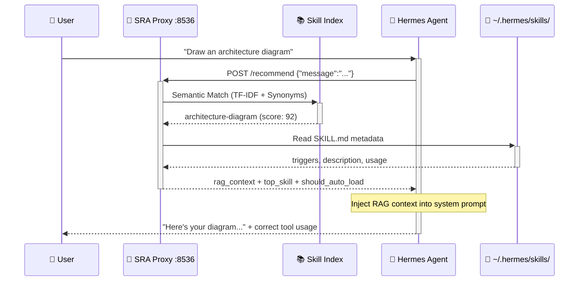
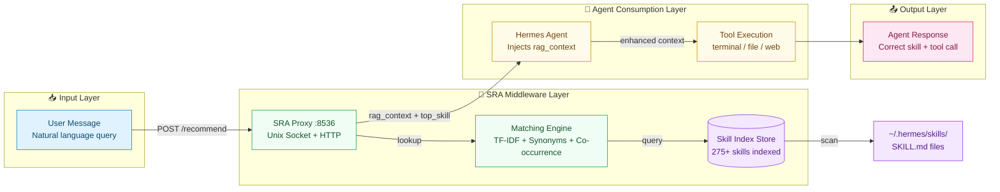

# SRA — Skill Runtime Advisor 🎯

[](https://www.python.org/)
[](./LICENSE)
[](https://github.com/JackSmith111977/Hermes-Skill-View)
[](https://pypi.org/project/sra-agent/)

> **A pre-message reasoning middleware that solves skill discovery for Hermes Agent (and any AI agent).**  
> Before every user message reaches the Agent, SRA Proxy performs semantic analysis and automatically injects the most relevant skill (SKILL.md) as RAG context — so the Agent always knows which capability to use.

🇨🇳 [中文文档](README.md) · 📖 [Runtime Design](./RUNTIME.md) · ⚡ [Quick Install](#installation) · 🩺 [Integration Guide](./docs/INTEGRATION.md)

---

## 📐 Architecture

### Message Flow (Sequence Diagram)



### Component Architecture



**In one sentence**: User says "draw an architecture diagram" → SRA finds the `architecture-diagram` skill in < 5ms → injects the skill's triggers and usage guide into the Agent's context → Agent immediately knows which tool to use.

---

## 🎯 Key Features

| Feature | Description |
|---------|-------------|
| **Pre-Message Reasoning** | Automatically queries the best-matching skills and injects RAG context before every user message reaches the Agent |
| **Semantic Matching Engine** | Hybrid matching with synonym expansion + TF-IDF + co-occurrence matrix — not just keyword search |
| **Daemon Process** | Runs 24/7 in the background with Unix Socket + HTTP dual protocol, auto-refreshes skill index on a schedule |
| **Coverage Analysis** | Tracks which skills are discoverable and which are blind spots, driving skill library quality improvements |
| **Agent Adapters** | Native output formatting for Hermes, Claude Code, Codex CLI, and other agents |
| **Zero-Intrusion Integration** | SRA doesn't modify Agent code — it adds a single HTTP call on the message path |

---

## 🤔 Why SRA?

As Hermes Agent's skill library (`~/.hermes/skills/`) grows (60+ and counting), the Agent faces four problems:

1. **Static list becomes ineffective** — The `<available_skills>` list gets too long, and the Agent frequently misses the most relevant skill
2. **New skills are invisible** — After adding a new SKILL.md, the Agent has no way of knowing it exists
3. **No feedback loop** — Which skill the Agent used and how well it worked is completely untrackable
4. **High discovery cost** — The Agent must iterate through all skills' triggers and descriptions to make a choice

**SRA's solution**: Insert a **semantically-aware layer** on the message path that uses TF-IDF + synonyms + co-occurrence matrix for real-time matching, injecting the most relevant skill context *before* the Agent processes the message.

---

## ⚡ Installation

> ⚠️ **China users**: raw.githubusercontent.com and github.com may be blocked. Use a proxy or the workarounds below if you encounter timeouts.

### Option 1: pip install (Recommended)

```bash
# Recommended: install in a virtual environment
python3 -m venv sra-env
source sra-env/bin/activate
pip install sra-agent

# Or use --user mode (global install)
pip install --user sra-agent

# Verify installation
sra version
```

> 💡 If the `sra` command is not found, make sure `~/.local/bin` is in your PATH:
> ```bash
> export PATH=$PATH:$HOME/.local/bin
> echo 'export PATH=$PATH:$HOME/.local/bin' >> ~/.bashrc
> ```

---

### Option 2: One-line installer (auto-configure + autostart)

```bash
# Basic install
curl -fsSL https://raw.githubusercontent.com/JackSmith111977/Hermes-Skill-View/master/scripts/install.sh | bash

# With autostart (auto-detects your system)
curl -fsSL https://raw.githubusercontent.com/JackSmith111977/Hermes-Skill-View/master/scripts/install.sh | bash -s -- --systemd
```

**China users**: raw.githubusercontent.com may be blocked. Try one of these:

```bash
# Option A: Use a proxy
export https_proxy=http://127.0.0.1:7890
bash -c "$(curl -fsSL https://raw.githubusercontent.com/JackSmith111977/Hermes-Skill-View/master/scripts/install.sh)"

# Option B: Clone the repo first
git clone --depth 1 https://github.com/JackSmith111977/Hermes-Skill-View.git
cd Hermes-Skill-View
bash scripts/install.sh
```

Supported systems:

| OS | Init System | sudo | Result |
|:---|:---|:---:|:---|
| Linux | systemd | ✅ | `/etc/systemd/system/srad.service` (system-level) |
| Linux | systemd | ❌ | `~/.config/systemd/user/srad.service` (user-level) |
| Linux + Hermes | systemd | ❌ | Same + Gateway dependency (`Wants=` soft dep) |
| macOS | launchd | — | `~/Library/LaunchAgents/com.sra.daemon.plist` |
| WSL | none | — | `~/.sra/sra-entry.sh` + Windows Task Scheduler guide |
| Docker | none | — | `~/.sra/sra-entry.sh` + docker restart guide |

> 💡 Use `--proxy` flag to enable Proxy mode (pre-message reasoning middleware):
> ```bash
> bash scripts/install.sh --systemd --proxy
> ```

---

### Option 3: From source

```bash
git clone --depth 1 https://github.com/JackSmith111977/Hermes-Skill-View.git
cd Hermes-Skill-View
python3 -m venv venv
source venv/bin/activate
pip install --no-build-isolation -e .
```

> ⚠️ Requires `setuptools>=61.0`; `--no-build-isolation` bypasses the system setuptools version check.

---

### Option 4: Proxy mode (pre-message reasoning)

Proxy mode is a flag for the one-line installer (Option 2), not a standalone installation method:

```bash
# Add --proxy to install.sh
bash scripts/install.sh --systemd --proxy

# Or run from source
cd Hermes-Skill-View
python3 venv/bin/sra attach --proxy
```

Proxy mode provides full JSON responses with RAG context at the `POST /recommend` endpoint, allowing Agent to query before processing each message.

---

### Uninstall SRA

```bash
# 1. Stop and disable systemd service
systemctl --user stop srad 2>/dev/null || sudo systemctl stop srad 2>/dev/null
systemctl --user disable srad 2>/dev/null || sudo systemctl disable srad 2>/dev/null

# 2. Uninstall Python package
pip uninstall sra-agent -y

# 3. Clean up config and data
rm -rf ~/.sra ~/.config/systemd/user/srad.service
rm -f ~/.config/systemd/user/hermes-gateway.service.d/sra-dep.conf
systemctl --user daemon-reload

# 4. If using system-level service
sudo rm -f /etc/systemd/system/srad.service
sudo systemctl daemon-reload
```

---

## 🚀 Quick Start

### 1. Start the daemon

```bash
sra start
# Expected output: SRA Daemon running...
```

### 2. Query skill recommendations

```bash
sra recommend "draw an architecture diagram"
# Expected output: -> Recommended skill: architecture-diagram, score: 92, confidence: high
```

### 3. Check status

```bash
sra status
# Expected output: running status, skill count, version
```

### 4. Proxy mode (pre-message reasoning)

```bash
curl -s -X POST http://127.0.0.1:8536/recommend \
  -H "Content-Type: application/json" \
  -d '{"message": "draw an architecture diagram"}'
```

Response example:
```json
{
  "top_skill": "architecture-diagram",
  "should_auto_load": true,
  "rag_context": "[SRA] Recommended: load architecture-diagram skill — generates dark-themed system architecture diagrams...",
  "recommendations": [
    {"name": "architecture-diagram", "score": 92, "confidence": "high"},
    {"name": "excalidraw", "score": 67, "confidence": "medium"}
  ],
  "timing_ms": 4.2
}
```

### 5. Integrate with Hermes Agent

Add pre-message reasoning rules in your SOUL.md or AGENTS.md:

```yaml
# Before every user message reaches the Agent, call SRA first
pre_process:
  - curl -s -X POST http://127.0.0.1:8536/recommend
    -H "Content-Type: application/json"
    -d '{"message": "<user message>"}'
  - Inject the returned rag_context into the Agent's system prompt
```

---

## 🔧 CLI Commands

| Command | Description |
|---------|-------------|
| `sra start` | Start the daemon process |
| `sra stop` | Stop the daemon process |
| `sra status` | Show running status |
| `sra recommend <query>` | Query skill recommendations |
| `sra coverage` | Show skill coverage analysis |
| `sra stats` | Show usage statistics |
| `sra version` | Display version |

---

## 🔌 Proxy API

| Endpoint | Method | Description |
|----------|--------|-------------|
| `/health` | GET | Health check |
| `/recommend` | POST | Skill recommendation (core endpoint) |
| `/targets` | GET | List all indexed skills |
| `/stats` | GET | Usage statistics |

### Response Fields

| Field | Type | Description |
|-------|------|-------------|
| `rag_context` | string | Formatted RAG context text, directly injectable into Agent system prompt |
| `recommendations` | array | Recommended skills list, sorted by score descending |
| `top_skill` | string | Highest-scoring skill name |
| `should_auto_load` | bool | True when top score ≥ 80, signals Agent to auto-load that skill |
| `sra_available` | bool | Whether SRA is reachable (daemon health) |
| `sra_version` | string | SRA version string |
| `timing_ms` | number | Processing latency in milliseconds, typically < 10ms |

---

## 💡 Design Philosophy

SRA is guided by three principles:

1. **Message before Tools** — SRA is not a "skill" the Agent loads; it's a **passively-triggered middleware** on every incoming message. It doesn't change the Agent's behavior — it enhances the Agent's context.
2. **AI Observability First** — Every component must provide status feedback (ok / warn / error). The AI always knows "what is the current state" and "what should I do next."
3. **Progressive Disclosure** — README (entry) → RUNTIME.md (runtime design) → docs/ (detailed documentation), go deeper only when needed.

> 📖 For the complete runtime design document, see [RUNTIME.md](./RUNTIME.md)

---

## 📊 Environment Check

After installation, verify everything is ready:

```bash
python3 scripts/check-sra.py
```

Expected output:
```
python: ok (3.11.5)
sra cli: ok (sra v1.2.1)
sra daemon: ok (port 8536, 313+ skills indexed)
skills dir: ok (~/.hermes/skills, 313+ skills)
sra config: ok (~/.sra/config.json)
```

---

## 🗺️ Roadmap

| Priority | Item | Target |
|----------|------|--------|
| 🔴 P0 | Fix watch_skills_dir file watcher | Instant detection of new skills |
| 🔴 P0 | Improve Chinese matching accuracy | Coverage to 95%+ |
| 🟡 P1 | Auto Agent integration script | One-command full setup |
| 🟡 P1 | Automated recommendation feedback loop | Auto-record skill usage by Agent |
| 🟢 P2 | Recommendation quality dashboard | Visual hit-rate display |

### Long-term Vision

- **Active learning**: Auto-adjust recommendation weights based on scenario memory, faster matching for high-frequency patterns
- **Multi-level recommendations**: Not just skill-level, but also recommend specific sections within a skill
- **Agent feedback loop**: Agent automatically feeds back results to SRA after using a recommended skill

---

## ❓ FAQ

**Q: `sra` command not found?**  
Check that PATH includes `~/.local/bin`, or retry with `pip install sra-agent`.

**Q: Daemon fails to start?**  
Run `python3 scripts/check-sra.py` to diagnose the environment and fix any failed checks.

**Q: Proxy mode not working?**  
Confirm the daemon is running and port 8536 is available. Run `sra status` to check.

**Q: Which agents are supported?**  
Native support for Hermes Agent. Also compatible with any agent that can make HTTP calls (Claude Code, Codex CLI, etc.) via the `/recommend` endpoint.

---

## 📝 License

MIT — see [LICENSE](./LICENSE) for details.
